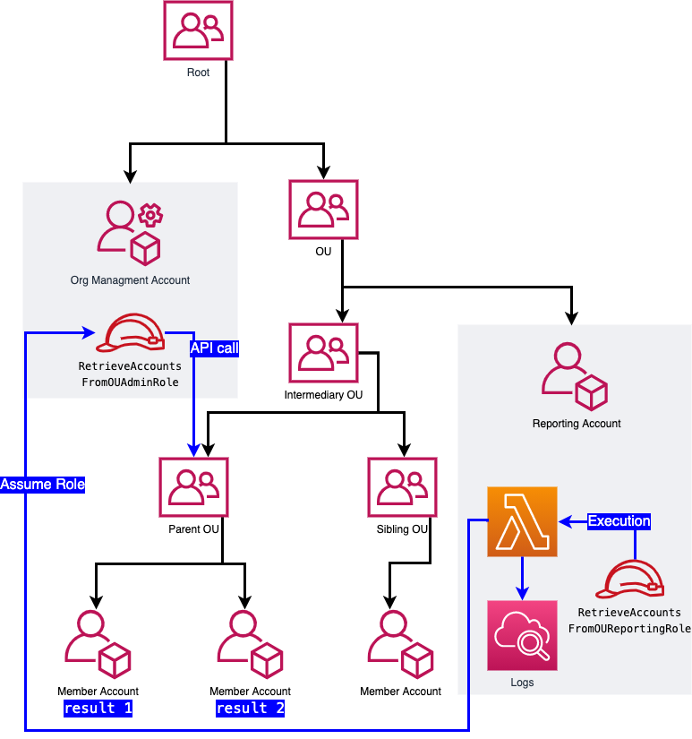

# Retrieve Accounts info from an Organization Unit

Educational code sample on how to retrieve all AWS accounts-id below an `Organization Unit (OU)`.

This example CDK project contains two stacks:
- On the Organization managment (root) account: create `IAM Role` to invoke relevant `AWS Organization` API
- On the reporting account: `AWS Lambda Function` to query and log the account info.

Latest code version is available at: [https://github.com/aws-samples/retrieve-accounts-from-organization-unit](https://github.com/aws-samples/retrieve-accounts-from-organization-unit)

## Architecture diagram



## Deploying this solution

### Prerequisites
- AWS CDK installed. Follow the installation guide [here](https://docs.aws.amazon.com/cdk/latest/guide/getting_started.html).
- Principal used for CDK deployment has access to CloudFormation and can create and write to a new S3 Bucket
- AWS Accounts:
    - An AWS account root of an `AWS Organization` and credentials to deploy on this account. 
    - Few illustrative AWS Accounts below an `Organisation Unit` in the same `AWS Organization`.
    - An AWS account in the same `AWS Organization` to run this solution, and credentials to deploy on this account. 

### 1. Initalize dependencies (do only once)

If you are on MacOS and Linux:

```
python3 -m venv .venv
source .venv/bin/activate
pip install -r requirements.txt
```

If you are on Windows:

```
python3 -m venv .venv
.venv\Scripts\activate.bat
pip install -r requirements.txt
```

### 2. Deploy on reporting account

First [target the account](HOWTO_select_target_account.md) that will query and report the OU accounts info.
Then deploy the CDK stack:

```
cdk bootstrap aws://unknown-account/unknown-region
cdk deploy ReportingAppStack  \
    --parameters managmentAccountId=<AWS Organisation managment account id, ie: 1234567890>  \
    --parameters organizationUnitId=<Organization Unit id, ie: ou-abcd-abcde1234>    
```

### 3. Deploy on Organization managment account

First [target the `AWS Organization` `managment account`](HOWTO_select_target_account.md). Then deploy the CDK stack:

```
cdk deploy ManagmentAccountRoleStack \
    --parameters reportingAccountId=<Account id where will run the reporting app, ie: 1112223335> \
    --parameters organizationId=<Organization id, ie: o-abcdefg123> \     
    --parameters organizationUnitId=<Organization Unit id, ou-abcd-abcde1234>    
```

### 4. Invoke Lambda Function and get output

You can execute the `Lambda function` directly in the `console` and then check the logs in `AWS CLoudWatch Logs`

or you can do the same via `AWS CLI`:

First [target the reporting account](HOWTO_select_target_account.md). Then: 

```
aws lambda invoke --function-name log-organization-unit-accounts-id response.json
```

finaly display the logs
```
export latestLogStreamName=`aws logs describe-log-streams --log-group-name '/aws/lambda/log-organization-unit-accounts-id' --query logStreams[-1].logStreamName --output text`
#echo $latestLogStreamName
AWS_PAGER="" aws logs get-log-events --log-group-name '/aws/lambda/log-organization-unit-accounts-id' --log-stream-name "$latestLogStreamName"
```


### 5. Clean Up

First [Target the `AWS Organization` `managment account`](HOWTO_select_target_account.md). Then:

```
cdk destroy managment_account_role
```

First [Target the reporting account](HOWTO_select_target_account.md). Then: 

```
cdk destroy reporting_app
```

## Security

See [CONTRIBUTING](CONTRIBUTING.md#security-issue-notifications) for more information.

## License

This library is licensed under the MIT-0 License. See the [LICENSE](LICENSE) file.